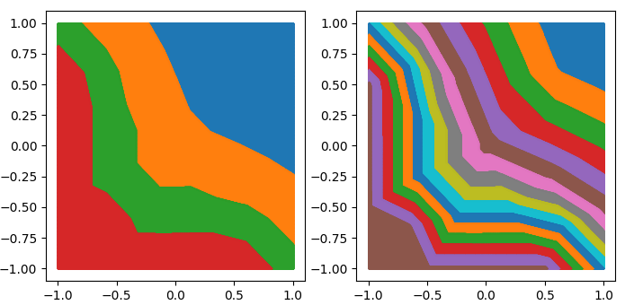
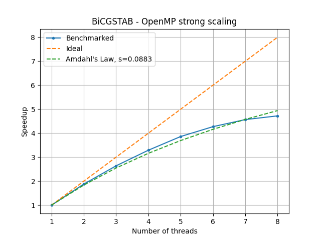
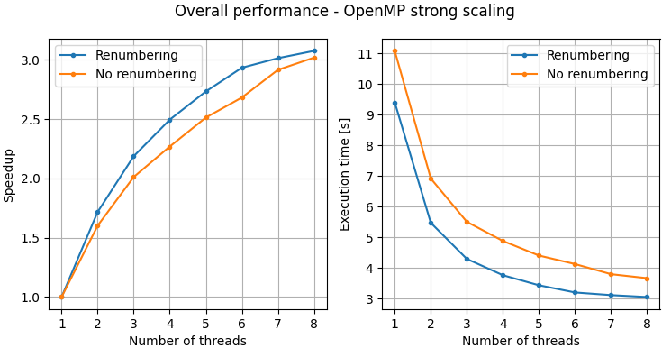

# Convection-Diffusion Equation in parallel
The goal of this project is to implement a numerical solver that is able to solve the convection-
diffusion equation through the use of the Finite Element Method. The software, has to be enhanced through the OpenMP directives, intended to exploit the concurrency opportunities of
the method.

The linear system arising from the discretization is solved repeatedly by means of the Bi-Conjugate Gradient Stabilized algorithm ([BiCGSTAB](https://en.wikipedia.org/wiki/Biconjugate_gradient_stabilized_method)).

## Parallelization

It is well known that the most time-consuming parts of this numerical approach are the assembly
of the global stiffness matrix and the solution of the linear system at each time step. This is why we
parallelized these two major sections using the OpenMP directives trying to take advantage of
computational resources of a multicore processor.

[OpenMP](https://en.wikipedia.org/wiki/OpenMP) is based on the [fork-join model](https://en.wikipedia.org/wiki/Fork%E2%80%93join_model) and allows us to manage a team of threads and splitting
our concurrent work among them in a shared memory setting.

# Benchmarks

Compiled with GNU Fortran 9.3.0 with the O3 optimization enabled, which outperformed O2 in all tests.

|                   |                                       |
| ----------------- | ------------------------------------- |
| Operating system  | Ubuntu 20.04.1 LTS                    |
| Processor         | Intel(R) Xeon(R) W-2245 CPU @ 3.90GHz | 
| Number of cores   | 8 physical, 2 threads per core        |
| L1d cache         | 256 KiB                               |
| L1i cache         | 256 KiB                               |
| L2 cache          | 8 MiB                                 |
| L3 cache          | 16,5 MiB                              |

## Input instance

The tests outlined in this work are based on a square mesh of triangular elements on a 2D plane.
The mesh is composed of 1312769 nodes arranged in 2621440 triangles. From a quick analysis on
the topology matrix we see the following connectivity aspects:

| Number of adjacent nodes (*neighborhood*) | How many nodes have that neighborhood |
| ----------------------------------------- | ------------------------------------- |
| 3                                         | 4                                     |
| 4                                         | 4092                                  |
| 5                                         | 4                                     |
| 6                                         | 1308668                               |
| 8                                         | 1                                     |

The following plots help having a visual understanding of how nodes of the grid are assigned to threads. For this specific input instance the nodes are renumbered in such a way that nodes with consecutive
IDs are geometrically near to each other. This guarantees that if the list of nodes is split in
partitions, the latters will minimize their adjacent borders.

</img>

## BiCGSTAB

The input to BiCGSTAB is a sparse matrix in CSR format and a dense right-hand side array. Generally
the algorithm iterates until it reaches the desired residual or reaches the maximum number of
iterations, but for benchmarking purposes the number of iterations has been set 200 and the RHS
is set to the one-vector.
The following is the scalability result obtained solving a sparse square matrix having 1312769 rows
and 9181185 non-zeros (sparsity = 99.9994673%).

</img>

## Overall

To asses the overall performance of the solver, we present a final benchmark carried out with the
same problem instance described before and the relative non-renumbered version. In this latter
version, when partitioning the grid nodes among the threads, a lot of elements are marked as non-
internal thus contributing to the global matrix through critical sections. This negatively affects both
performance and scalability, as shown in the following plot.

</img>

